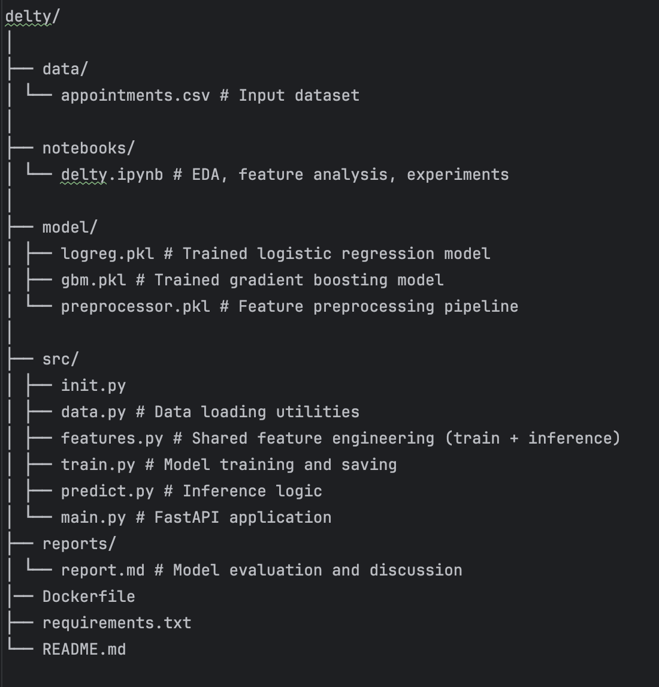
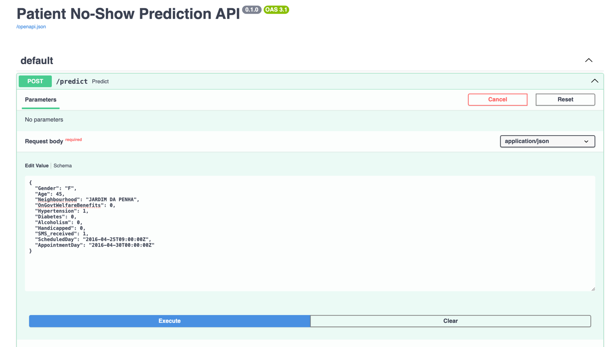
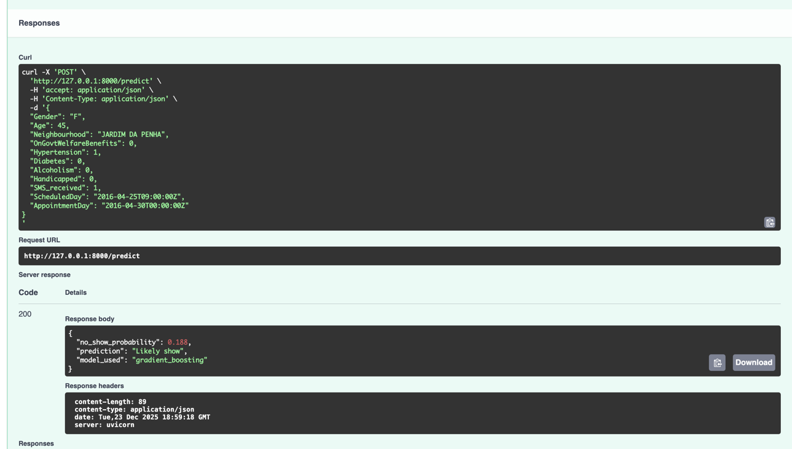

# Healthcare Patient No-Show Prediction

This project builds an end-to-end machine learning system to predict whether a patient is likely to miss a scheduled medical appointment (no-show).  
The goal is to help healthcare clinics proactively identify high-risk appointments and take preventive action.

The system includes:
- Data exploration and feature engineering
- Model training and evaluation
- Saved model artifacts
- A FastAPI service for real-time predictions

---

## Project Structure


Please refer to notebooks/delty.ipynb for complete deliverables of Part 1 and Part 2. 
Part 3 and Part 4 requirements can be found in this repository

---

## Setup Instructions

### 1. Create and activate a virtual environment 

```bash
python -m venv .venv
source .venv/bin/activate
```

### 2. Install Requirements and add dataset
```bash
pip install -r requirements.txt
```
The dataset is within gitignore, so for local execution, place the appointments.csv file within data/

### 3. Model Training (Offline)
```bash
python -m src.train
```
This will create the following files:
model/logreg.pkl
model/gbm.pkl
model/preprocessor.pkl

### 4. Using the Dockerfile
```bash
docker build -t delty-no-show .
docker run -p 8000:8000 delty-no-show
```

### 5. Running the API
```bash
uvicorn src.main:app --reload
```
Swagger UI for testing: http://127.0.0.1:8000/docs



Sample payload:
```bash
{
  "Gender": "F",
  "Age": 45,
  "Neighbourhood": "JARDIM DA PENHA",
  "OnGovtWelfareBenefits": 0,
  "Hypertension": 1,
  "Diabetes": 0,
  "Alcoholism": 0,
  "Handicapped": 0,
  "SMS_received": 1,
  "ScheduledDay": "2016-04-25T09:00:00Z",
  "AppointmentDay": "2016-04-30T00:00:00Z"
}

```
```bash
curl -X 'POST' \
  'http://127.0.0.1:8000/predict' \
  -H 'accept: application/json' \
  -H 'Content-Type: application/json' \
  -d '{
  "Gender": "F",
  "Age": 45,
  "Neighbourhood": "JARDIM DA PENHA",
  "OnGovtWelfareBenefits": 0,
  "Hypertension": 1,
  "Diabetes": 0,
  "Alcoholism": 0,
  "Handicapped": 0,
  "SMS_received": 1,
  "ScheduledDay": "2016-04-25T09:00:00Z",
  "AppointmentDay": "2016-04-30T00:00:00Z"
}
'
```
